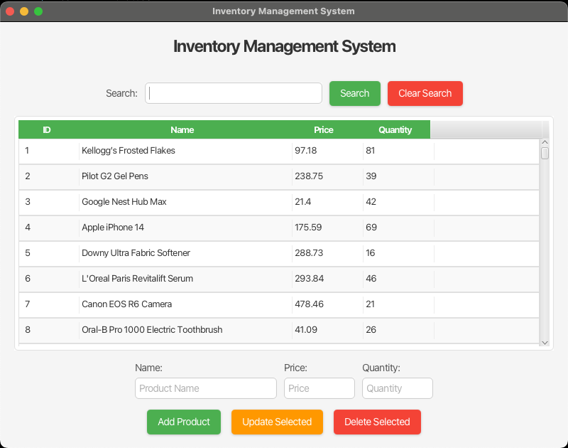

# Inventory Management System

A desktop application built to manage product inventory, featuring a user-friendly interface and robust backend integration. This project showcases my skills in full-stack development using modern Java technologies.

## Features

- **View Products**: Displays a table of all products with columns for ID, Name, Price, and Quantity, featuring sortable headers and alternating row colors.
- **CRUD Operations**:
  - **Create**: Add new products with automatic ID generation.
  - **Read**: View all products or filter by name using the search feature.
  - **Update**: Modify existing product details with validation.
  - **Delete**: Remove products from the inventory.
- **Search Functionality**: Filter products by name with a real-time search bar and a "Clear Search" option.
- **Input Validation**: Ensures all fields (name, price, quantity) are valid before adding or updating products (non-empty, numeric, positive values).
- **Polished UI**: Modern design with a clean layout, labeled fields, and color-coded buttons:
  - Green for "Add Product" and "Search" (positive actions).
  - Orange for "Update Selected" (modification).
  - Red for "Delete Selected" and "Clear Search" (destructive actions).
- **Data Persistence**: Stores data in an SQLite database, with initial data loaded from a CSV file.
- **Seamless Integration**: Combines Spring Boot backend and JavaFX frontend in a single executable JAR, with a retry mechanism to ensure startup reliability.

---

## **🖥️ Screenshots**
✅ **Main Dashboard**  
- 

---

## Tech Stack
- **Frontend**: 
  - JavaFX: GUI framework for the desktop interface.
  - FXML: XML-based markup for UI layout.
  - CSS: Custom styles for a polished look.
- **Backend**: 
  - Spring Boot: Framework for RESTful API and application logic.
  - Spring Web: Implements REST endpoints for CRUD and search operations.
  - Spring Data JPA: Simplifies database interactions with SQLite.
- **Database**: 
  - SQLite: Lightweight, serverless database.
  - SQLite JDBC: Connects Java to SQLite.
- **Build Tool**: 
  - Maven: Manages dependencies and builds the project with the `-parameters` flag for Spring compatibility.
- **Data Generation**: 
  - Mockaroo: Generates realistic product data in CSV format (200 initial entries).
- **Language**: Java 23, leveraging modern features and performance.

## Setup
1. Clone the repo: `git clone <https://github.com/jnima2022/InventoryManagementSystem.git>`
2. cd inventory-management-system
3. Build: `mvn clean package`
4. Run: `java -jar target/inventory-management-system-1.0-SNAPSHOT.jar`

### Prerequisites
- Java Development Kit (JDK) 23 installed.
- Maven installed (for building the project).
- Git (optional, for cloning the repository).

## Usage
  - Start: Launch the JAR, and the table will populate with products after a brief delay (ensuring the backend is ready).
  - Add: Enter a name, price, and quantity, then click the green "Add Product" button.
  - Update: Select a product, modify the fields, and click the orange "Update Selected" button.
  - Delete: Select a product and click the red "Delete Selected" button.
  - Search: Type a name in the search field and click the green "Search" button, or press Enter. Clear the filter with the red "Clear Search" button.
---
- Demo:
[Click here to watch the demo](https://github.com/jnima2022/InventoryManagementSystem/issues/1#issue-2889726395)

---

## Project Highlights
- **Full-Stack Integration**: Combined JavaFX frontend with a Spring Boot REST API in a single JAR, resolving startup delays with a retry mechanism.
- **Robust CRUD**: Implemented create, read, update, and delete operations via REST endpoints, ensuring data persistence and validation with SQLite.
- **Dynamic Search**: Added a searchable interface with real-time filtering through a REST API, enhancing usability beyond static CSV editing.
- **Polished UI**: Designed a modern, color-coded interface with custom CSS, improving visual appeal and user experience.
- **Technical Problem-Solving**: Fixed issues like parameter mapping (via Maven’s `-parameters` flag) and database initialization logic.

## Future Improvements
  - Include a status bar for success/error messages.
  - Support exporting the inventory to CSV.
  - Create a button to upload csv files on UI.
